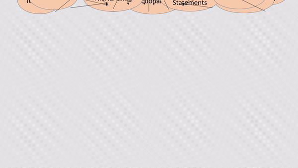

## PythonConcepts


[][license]

###  :earth_asia: Introduction
This is a repository consisting of code and important information on most of the Core Python Language Features, ranging from basic data types to advanced topics. 



***

###  :computer: Supported Python Version
The Python features upto Python 3.7 have been covered (Python 2 has not been considered). Preferred Python version to use - **Python 3.0** to **Python 3.7**.

***

###  :books: Concepts Covered and Recommended Study Sequence
* Introduction
* Syntax, Variables, Comments
* NumericDataTypes
* Lists
* Dictionaries
* Sets
* Tuples
* Strings
* Operators
* ConditionalStatements
* Loops
* Classes And Objects
* Functions
* Inheritance
* try
* Exceptions
* FileHandling 
* Modules
* Iterators
* Generators
* Pass
* JSON

***

###  :loop: Example
`for` loop in Python
```python
def forLoop():
	mySampleString = "Every day is a beautiful day."
	for letter in mySampleString:
		print(letter, end="")
	print("")
forLoop()	
```
***

###  :wrench: Setup & Tools
* Python 3.7
* PyCharm (or any other Python IDE)

***
	
###  :running: Getting Started
```sh
$ git clone 
$ cd 
$ import project in PyCharm (or any other Python IDE)
```
***

###  :pencil: Author

* **Sumon Dey** - *Initial work* - [sumon-dey](https://github.com/sumon-dey "Sumon Dey") 

>Keep Smiling and Practice Hard 

[license]: https://opensource.org/licenses/Apache-2.0


